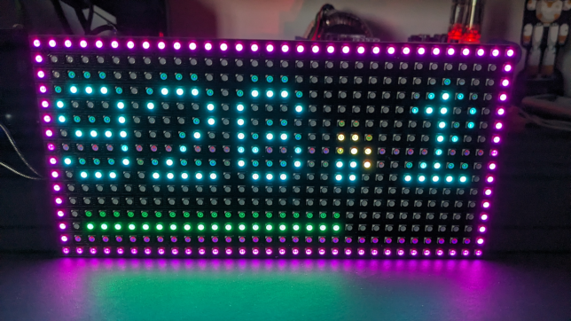
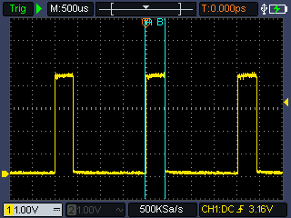

# Minimal UNO HUB75 display driver
This library will control one 32x16 HUB75 display using an Arduino UNO style board.  The libarary will do 8 color (3 bit) display using a double-buffered framebuffer to prevent flickering.  Ideally, the updates will be performed in the Timer 2 ISR, but can optionally be done in the caller's main loop.

Click image below for a YouTube video of panel running simple animation:  
[](https://youtu.be/FURhSpXdA1c)

Note that the library provides two methods for updating the display; each requires calling the `update()` method.  The first is to do it on your own time - for example, putting a single `update()` call in the sketch's main `loop()` function.  This will result is a brighter display, but it will be inconsistently bright; that is, it will look a little flicker-y because the timing of the updates won't be consistent from one pass to the next.

The other method is to use a hardware timer and call `update()` in the ISR for that timer.  This provides much more consistent update timing.  It probably won't be as bright, but it will look more "steady".  More info on this below.

### Features
The library provides drawing primitives such as individual pixel write/read, arbitrary lines, and filled and unfilled rectangles in the colors black, red, yellow, green, cyan, magenta, blue, and white.  There are methods to fill the entire display, copy single pixels and even rectangular regions across the display.  There is a bitmapped 5x7 font available for writing text on the display.

Simple animations and scrolling can be accomplished by simply redrawing the buffer at a decent rate.

# Using the library
## Hardware
The library uses 12 pins of the Uno to drive the HUB75 display.  Use Google or other search engine for more information on the hardware interface of HUB75; there are a lot of good resources out there.

The 6 color output pins are in sequential order on AVR hardware port B to make shifting color data in faster.  Also, note that PORTD pins 0 and 1 (Arduino pins 0 and 1) are not used; this leaves the TX and RX signals of UART 0 free.

| AVR Port | AVR Pin | Arduino UNO Pin | HUB75 Display | Description | 
| --- | --- | --- | --- | --- |   
| Port D | Pin 2 | 2 | R1 | Red 1 (upper half red) |  
| Port D | Pin 3 | 3 | G1 | Green 1 (upper half green) |  
| Port D | Pin 4 | 4 | B1 | Blue 1 (upper half blue) |  
| Port D | Pin 5 | 5 | R2 | Red 2 (upper half red) |  
| Port D | Pin 6 | 6 | G2 | Green 2 (upper half green) |  
| Port D | Pin 7 | 7 | B2 | Blue 2 (upper half blue) |  
| Port B | Pin 0 | 8 | A | Row 'A' select |  
| Port B | Pin 1 | 9 | B | Row 'B' select |  
| Port B | Pin 2 | 10 | C | Row 'C' select |  
| Port B | Pin 3 | 11 | CLK | bit clock for shifting in color data |  
| Port B | Pin 4 | 12 | LAT | Latch shift register |  
| Port B | Pin 5 | 13 | OE | Output enable (active low) |  

If you need to reassign pins for the HUB75 display, you'll end up editing `panel_impl.h` and `panel.cpp`.  If you want to reassign the pins used for `R1`, `G1`, `B1`, `R2`, `G2`, or `B2` you're going to end up rewriting the `update()` method in such a way that each update to the panel will take more time.  Don't do that.

## Software
Instantiate a member of the Panel class.  The `begin()` method takes two arguments (with default values); the first defines if the update method will be called from the Timer 2 ISR, and the second defines a coordinate translation method.

Once instantiated, "draw" on the panel by using the included primitives or even pixel-by-pixel.  When the desired items are drawn, call the `draw()` method to copy the working frambuffer to the output framebuffer; this double-buffering prevents flickering.

The `update()` method needs to be called periodically; either as part of the Timer 2 ISR if desired, or as part of your application's main loop.  

If using the ISR method (which is preferred), you must add this to your sketch:  
``` 
ISR(TIMER2_COMPA_vect, ISR_BLOCK)
{
  panel.update();
}
```  
*Change the name of the class instance `panel` to whatever you are using.*  
### Enums
There is one enumeration for color:
```   
enum Colors
{
  BLACK = 0,
  RED,
  GREEN,
  YELLOW,
  BLUE,
  MAGENTA,
  CYAN,
  WHITE
};
```   
All of the primitive methods for drawing or printing on the display are expecting a member of this enum for the color parameter.
### Structs
There are two structures used by the library:  the `Point` and the `Rect` structs.  `Point` defines a point in terms of `X/Y` coordinates, and `Rect` defines a rectangular region defined by the two opposite corner `X/Y` coordinates:
```   
typedef struct
{
  int16_t x;
  int16_t y;
} Point;

typedef struct
{
  int16_t x1;
  int16_t y1;
  int16_t x2;
  int16_t y2;
} Rect;
```  
### Public methods
These are the public methods of the library:  

`begin(bool useISR, void(*xlater)(int16_t& x, int16_t& y))` - this method will initialize the buffers and set up the internal state of the library.  Parameters:  
+ `bool useISR` - set to `true` if you want to use the Timer 2 interrupt for updating (this is the recommended method).  Set to `false` if you plan on using Timer 2 for something else, or just prefer to control the timing of the calls to `update()`.  When `true`, Timer 2 will be set up to trigger every 2 milliseconds. 
+ `void(*xlater)(int16_t& x, int16_t& y)` - this is a pointer to a function that can be used to translate and modify the X/Y coordinate system.  By default, the `(0,0)` point will be at the upper left of the panel.  It may be more convenient from a math standpoint to have the origin at the lower left corner.  In that case, the `Y` coordinate can be remapped to provide this by something as simple as:   
  ```
  void origin(int16_t& x, int16_t& y)
  {
    y = MAXROWS - y;
  }
  ```
This can also be used to translate the coordinate system so the panel can be rotated 90 or 270 degrees.

`void update()` - this method needs to be called at a fairly high rate to provide a decent display.  The recommended method as in an ISR, preferably Timer 2 as would be configured in the `begin()` method.  `void update()` has been measured to that 440 us (microseconds) to complete.  If using the Timer 2 update rate of 2 ms (milliseconds) as defined by the `begin()` method, about 1/4 of the ATMega's processing time will be taken up by `update()`, which is fairly reasonable.

`void draw()` - all "drawing" on the panel done by the library methods are done to the local framebuffer and won't actually be written to the display panel until the `draw()` method is called.  This prevents flickering of the display.  Basically, draw whatever you want on the display, then call `draw()` to copy that to the output framebuffer that the `update()` method uses.
`void clear()` - erases the display by setting all pixels to black (remember to call `draw()` for it to take affect)

`void fillAll(Panel::Colors c)` - sets all pixels in the display to the specified color `c` (see enums and structs section for colors)

`void setPixel(int16_t x, int16_t y, Panel::Colors c)`  
`void setPixel(Panel::Point& p, Panel::Colors c)` - both of these set the specified pixel to color `c`

`void line(int16_t x1, int16_t y1, int16_t x2, int16_t y2, Panel::Colors c)`  
`void line(Panel::Point& start, Panel::Point& end, Panel::Colors c)` - both of these draw a line on the display, one pixel wide, using color `c`.  Line may be horizontal, vertical, or diagonal.  Non horizontal/vertical lines are drawn using y=mx+b form, but your results may vary on a display with such low resolution.  Lines at 45 degrees look good, but other angles may not be great.

`void rectangle(int16_t x1, int16_t y1, int16_t x2, int16_t y2, Panel::Colors c, bool fill = true)`  
`void rectangle(Panel::Point& topLeft, Panel::Point& btmRight, Panel::Colors c, bool fill = true)`  
`void rectagle(Panel::Rect& rect, Panel::Colors c, bool fill = true)` - all of these 3 methods will draw a rectangle on the display in color `c`.  If `fill` is set to `true`, the rectangle will be filled with color `c`; otherwise it will be an outline one pixel wide of color `c`.

`void filledBox(int16_t x1, int16_t y1, int16_t x2, int16_t y2, Panel::Colors c)`  
`void filledBox(Panel::Point& topLeft, Panel::Point& btmRight, Panel::Colors c)`  
`void filledBox(Panel::Rect& rect, Panel::Colors c)` - all of these 3 methods will draw a filled rectangle on the display in color `c`.  

`void outlineBox(int16_t x1, int16_t y1, int16_t x2, int16_t y2, Panel::Colors c)`  
`void outlineBox(Panel::Point& topLeft, Panel::Point& btmRight, Panel::Colors c)`  
`void outlineBox(Panel::Rect& rect, Panel::Colors c)` - all of these 3 methods will draw an unfilled rectangle on the display in color `c`.  

`void copyPixel(int16_t x1, int16_t y1, int16_t x2, int16_t y2)`  
`void copyPixel(Panel::Point& src, Panel::Point& dst)` - both of these 2 methods can be used to copy a single pixel from one place on the display to another.

`void copyRegion(Panel::Rect& src, Panel::Rect& dst)` - copies a rectangular region of the panel from one location to another.  

`Panel::Colors getPixel(int16_t x, int16_t y)` - return a member of the `Colors` enum for the color of the given pixel

# Gorey details of things
Since this library is only 8 colors, we only need 3 bits to represent those 8 colors for a single pixel.  That means we can pack 2 pixels into each byte of buffer, so the buffer only needs to be 1/2 the size of physical pixel layout of the panel.

To make things even easier, when shifting pixel color bits into the display, you shift in data for 2 pixels; one if the upper half and a corresponding row in the lower half.  So each byte of the buffer contains 2 pixels - one in th eupper half and one in the lower half.  To be more specific:
```  
  (an arbitrary buffer byte)
    BIT  7  6  5  4  3  2  1  0
         |  |  |  |  |  |  |  |
         |  |  |  |  |  |  |  +--> unused
         |  |  |  |  |  |  +-----> unused
         |  |  |  |  |  +--------> The "red" bit for the upper half pixel
         |  |  |  |  +-----------> The "green" bit for the upper half pixel
         |  |  |  +--------------> The "blue" bit for the upper half pixel
         |  |  +-----------------> The "red" bit for the lower half pixel
         |  +--------------------> The "green" bit for the lower half pixel
         +-----------------------> The "blue" bit for the lower half pixel
```  
This makes the update routine to the physical display very clean if we can copy each byte directly into a PORTx register.  Doing 6 individual bit operations on Arduino pins (especially using the Arduino `digitalWrite()` method) would take considerably more time than something like `PORTD = buffer[thisPixel]`.

Using another pin for timing, I used a scope to measure the actual time required to update the entire panel - it came out to 440 us (microseconds):  


There are two unused bits in each byte.  Looking at `PORTD` on the ATMega328, we see that alternate functions for pins 0 and 1 on that port are for the UART TX and RX signals.  That's why the buffer has the color bits shifted left 2 - to keep UART pins free.

The framebuffer is then 1/2 of the product of the rows and columns of the display.  This display is 32 X 16 pixels, so that makes for a 256 byte buffer.  This leave plenty of room for a second for double-buffering, necessary to keep the display from "flickering" as things are drawn.  A total of 512 bytes out of the total 2048 available leaves enough for creating programming :)

# Motivation
I was digging through my parts drawers when I came across the display panel.  I bought it from Adafruit some time ago for a project I never finished (sigh).  I went to the products page on Adafruit to remind myself what it was capable of: [Medium 16x32 RGB LED matrix panel - 6mm pitch](https://www.adafruit.com/product/420).

There was a line on the page that really caught my eye:
 
You'll need about 1600 bytes of RAM to buffer the 12-bit color image. **You cannot use this size panel with an Arduino UNO (ATmega328) or ATmega32u4 - you need a chip with more RAM!**   

(emphasis Adafruit, not mine)

Sure, if you want to do full 12-bit color, you'll need that much RAM, but what if you only did 8 colors?  With double buffering and byte packing, that should only be 512 bytes - a quarter of what the ATMega32 family has.  

I've also seen writeups that will say you need high speed microcontrollers or even an FPGA to drive them.  Can I do it with the resources of an ATMega32?  This MCU family are 8-bit AVRs running at 16MHZ with 2KB of RAM and 32KB of Flash memory.  

I happened to have some UNO-style boards in the same drawer, so I decided to give it a try.  This library is the result!
